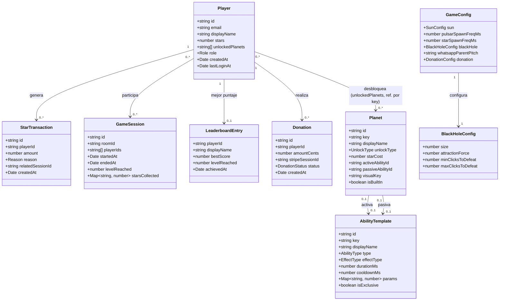
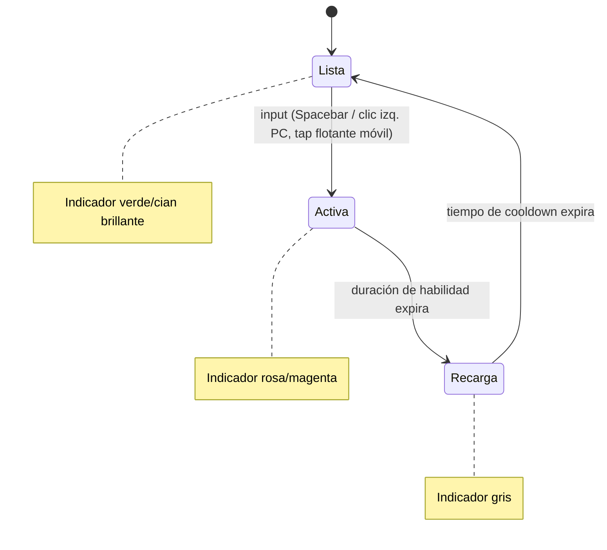
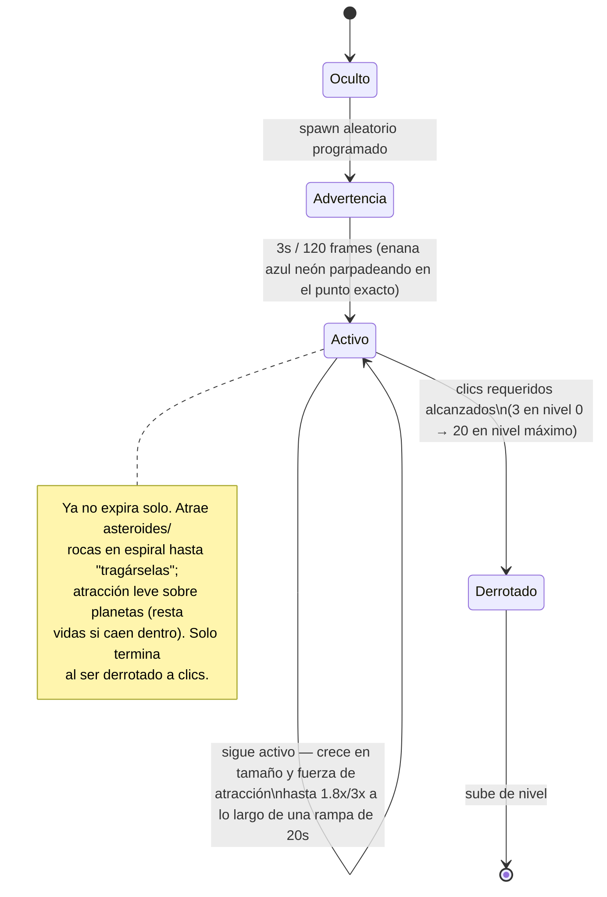
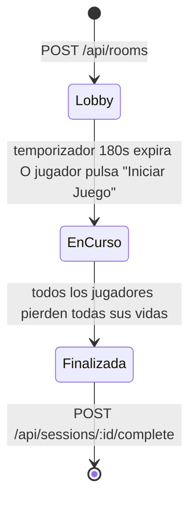
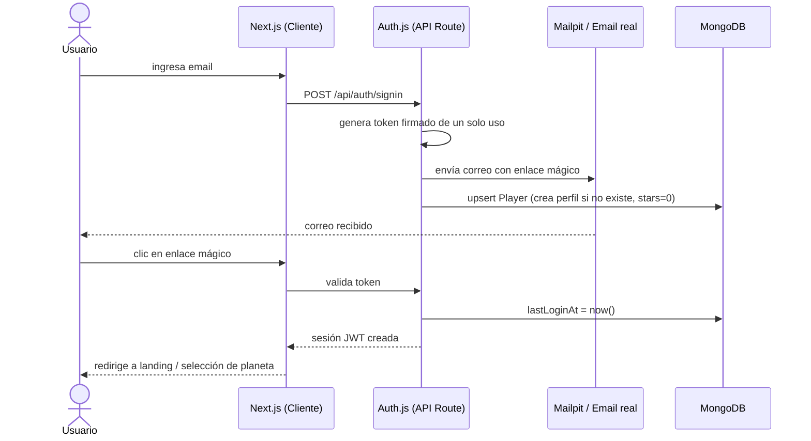
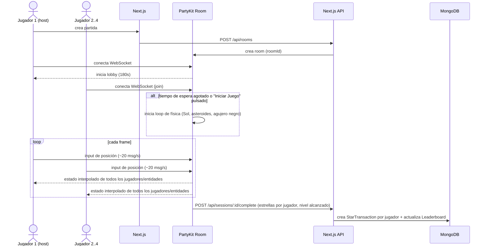
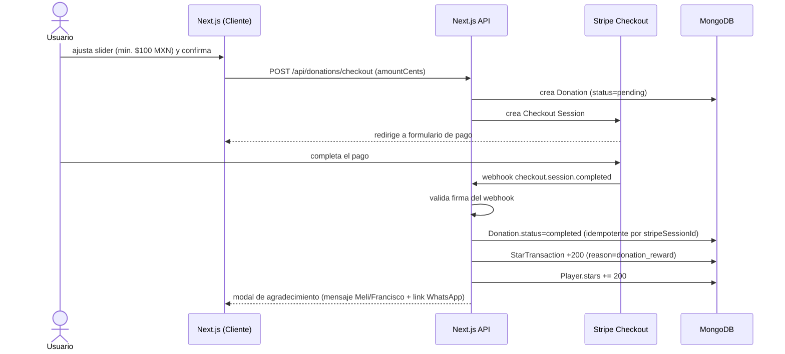
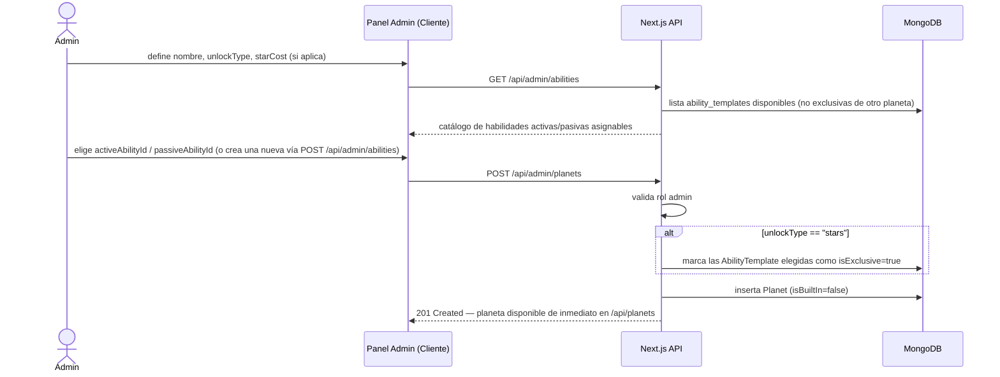
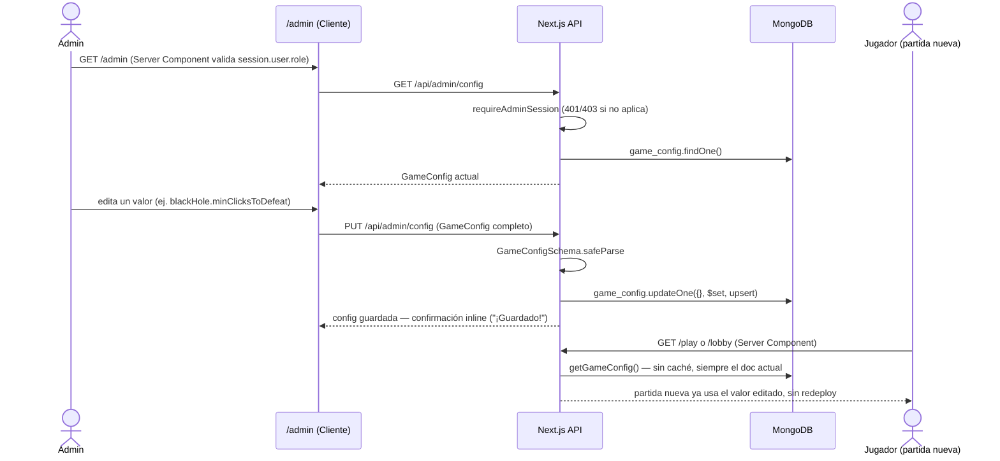
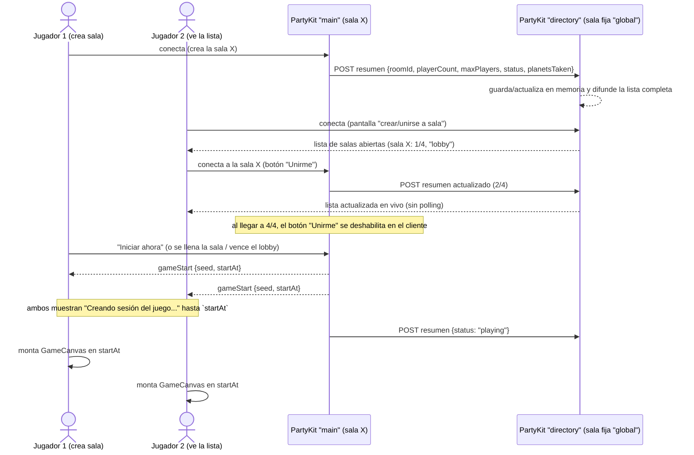

# DIAGRAMAS.md — Planet Scape of the Solar System

> Diagrama de clases, máquinas de estado, diagramas de secuencia y modelo de persistencia.
> Sincronizado con [`AGENTS.md`](./AGENTS.md) y [`SPECIFICATION-SUMMARY.md`](./SPECIFICATION-SUMMARY.md) — ver regla de sincronización en [AGENTS.md §0.1](./AGENTS.md#01-regla-de-sincronizacion-de-documentacion).

---

## 1. Diagrama de Clases (dominio)

> `Planet` y `AbilityTemplate` son colecciones dinámicas gestionables desde el admin (ver [`SPECIFICATION-SUMMARY.md` §3.1](./SPECIFICATION-SUMMARY.md#31-reglas-de-negocio-planetas-y-habilidades-dinamicas)) — ya no son un enum fijo en código.



---

## 2. Diagramas de Máquina de Estados

### 2.1 Habilidad de Planeta (Activa)



### 2.2 Agujero Negro

> Actualizado 2026-07-22: la fase Activa ya **no expira sola** — el usuario pidió que el Agujero Negro permanezca hasta ser derrotado a clics, volviéndose más fuerte mientras más tiempo sobrevive (ver [`AGENTS.md` §4](./AGENTS.md#4-motor-grafico-y-animacion)). El diagrama original tenía una transición `Activo --> Oculto` por expiración de tiempo que ya no existe en el código (`engine/entities/BlackHole.ts`).



### 2.3 Partida (Game Session)



---

## 3. Diagramas de Secuencia

### 3.1 Login por Magic Link



### 3.2 Partida Multijugador (creación → cierre)



### 3.3 Aportación Voluntaria (Stripe)



### 3.4 Admin crea un Planeta Nuevo



### 3.5 Admin edita el balance del juego ✅ implementado y probado



### 3.6 Salas abiertas (directorio de lobbies) ✅ implementado y probado



---

## 4. Modelo de Persistencia (MongoDB)

```mermaid
erDiagram
    PLAYERS ||--o{ STAR_TRANSACTIONS : genera
    PLAYERS ||--o{ DONATIONS : realiza
    PLAYERS ||--o| LEADERBOARD : "mejor puntaje"
    PLAYERS }o--o{ GAME_SESSIONS : participa
    PLAYERS }o--o{ PLANETS : "desbloquea (unlockedPlanets, ref. por key)"
    GAME_SESSIONS ||--o{ STAR_TRANSACTIONS : "origina (reason=gameplay)"
    PLANETS |o--o| ABILITY_TEMPLATES : "activa"
    PLANETS |o--o| ABILITY_TEMPLATES : "pasiva"

    PLAYERS {
        ObjectId _id PK
        string email UK
        string displayName
        int stars
        string[] unlockedPlanets
        string role
        date createdAt
        date lastLoginAt
    }
    STAR_TRANSACTIONS {
        ObjectId _id PK
        ObjectId playerId FK
        int amount
        string reason
        ObjectId relatedSessionId FK
        date createdAt
    }
    GAME_SESSIONS {
        ObjectId _id PK
        string roomId
        ObjectId[] playerIds FK
        date startedAt
        date endedAt
        int levelReached
    }
    LEADERBOARD {
        ObjectId playerId PK-FK
        string displayName
        int bestScore
        int levelReached
        date achievedAt
    }
    DONATIONS {
        ObjectId _id PK
        ObjectId playerId FK
        int amountCents
        string currency
        string stripeSessionId UK
        string status
        date createdAt
    }
    GAME_CONFIG {
        ObjectId _id PK
        object sun
        object pulsars
        object stars
        object blackHole
        object whatsappLinks
        object donation
    }
    PLANETS {
        ObjectId _id PK
        string key UK
        string displayName
        string unlockType
        int starCost
        ObjectId activeAbilityId FK
        ObjectId passiveAbilityId FK
        string visualKey
        boolean isBuiltIn
        date createdAt
        date updatedAt
    }
    ABILITY_TEMPLATES {
        ObjectId _id PK
        string key UK
        string displayName
        string type
        string effectType
        int durationMs
        int cooldownMs
        object params
        boolean isExclusive
        date createdAt
        date updatedAt
    }
```

`game_config` es un documento único (sin relación FK) leído por el servidor de PartyKit y por el panel admin — ver [AGENTS.md §7](./AGENTS.md#7-persistencia--decision-y-justificacion). `planets` y `ability_templates` son catálogos dinámicos editables/creables desde el admin — ver reglas de negocio, incluida la exclusividad de habilidades de planetas `unlockType: "stars"`, en [`SPECIFICATION-SUMMARY.md` §3.1](./SPECIFICATION-SUMMARY.md#31-reglas-de-negocio-planetas-y-habilidades-dinamicas).
