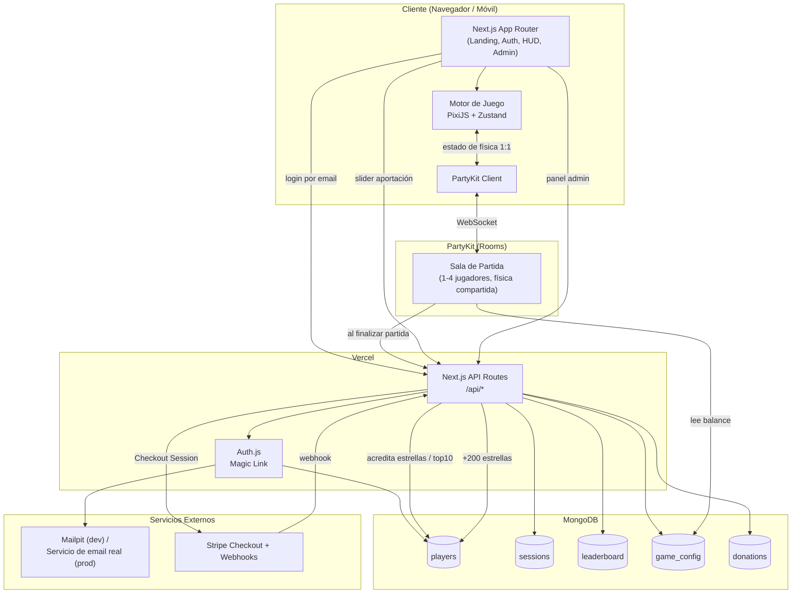

# SPECIFICATION-SUMMARY.md — Planet Scape of the Solar System

> Contratos de API, esquemas Zod, tabla de tecnologías justificadas y diagrama Mermaid general de interacción.
> Sincronizado con [`AGENTS.md`](./AGENTS.md) — ver regla de sincronización en [AGENTS.md §0.1](./AGENTS.md#01-regla-de-sincronizacion-de-documentacion). Ver diagramas UML complementarios en [`DIAGRAMAS.md`](./DIAGRAMAS.md).

---

## 1. Tabla de Tecnologías Justificadas

| Capa | Tecnología | Justificación |
|---|---|---|
| Framework | **Next.js 16+ (App Router, Turbopack) + TypeScript** | Pedido explícito en el prompt. Next.js 16 es la versión estable vigente (16.2.x a julio 2026), con Turbopack como bundler por defecto (build/dev sensiblemente más rápidos que Webpack, relevante dado el motor de juego pesado en cliente). SSR para landing/SEO, API Routes para backend ligero, despliegue nativo en Vercel. |
| Renderizado del juego | **PixiJS (WebGL 2D)** | El juego mueve simultáneamente hasta ~10 llamaradas, decenas de asteroides, pulsares, partículas de lava/estrellas y 4 jugadores en paralaje continuo. Canvas 2D puro degrada por debajo de 60 FPS con esa cantidad de sprites; PixiJS usa WebGL con sprite batching y mantiene fluidez incluso en gama media/móvil. |
| UI / Chrome del juego | **Framer Motion** | Animaciones de menús, HUD, barra de habilidad, toasts y transiciones de nivel — declarativo y ya integrado en el ecosistema React/Next. |
| Personajes y fondo | **SVG animado (inline / `next/dynamic`) + CSS** | Decisión confirmada por el usuario: vectorial, escala perfecta a cualquier pantalla, cero necesidad de storage de archivos (S3/RustFS excluido), fácil de re-colorear por tema/planeta. |
| Landing page | **`frontend-design` (skill) + paleta inspirada en SolarBalls** | Ver [AGENTS.md §1.1](./AGENTS.md#11-landing-page--requisito-de-diseno-profesional): la primera impresión del juego debe pasar por diseño profesional dedicado, no maquetado genérico. |
| Estado global lento | **React Context (`GlobalContext`)** | Requisito de la skill: sesión de usuario, locale, configuración de admin cacheada. Cambia con poca frecuencia → seguro para Context sin penalizar renders. |
| Estado del loop de juego (60 FPS) | **Zustand (store fuera de React)** | El estado de física/posiciones cambia cada frame; usar Context aquí forzaría re-renders masivos de React. Zustand permite mutar y leer fuera del ciclo de render, PixiJS se suscribe directo. |
| Tiempo real / multijugador | **PartyKit** | Diseñado específicamente para juegos multijugador en tiempo real sobre Next.js/Vercel (modelo de "rooms" = partidas de hasta 4 jugadores). Evita el problema de que Vercel Serverless no soporta WebSockets persistentes. Tier gratuito suficiente para esta escala. Alternativa evaluada y descartada: Socket.io con servidor Node dedicado (requiere infraestructura adicional fuera de Vercel, mayor complejidad operativa para el tamaño de este proyecto). |
| Autenticación | **Auth.js (NextAuth) — Email Provider (Magic Link)** | Estándar de facto en Next.js para magic link, soporta adaptador oficial de MongoDB (`@auth/mongodb-adapter`), configurable para usar Mailpit como transporte SMTP en local. |
| Base de datos | **MongoDB (driver nativo + Auth.js adapter)** | Esquema flexible ideal para perfiles de jugador, historial de estrellas variable y configuración de admin. Confirmado por el usuario. |
| Pagos | **Stripe (Checkout + Webhooks)** | Pedido explícito. Checkout Session para el monto variable del slider; webhook `checkout.session.completed` acredita las 200 estrellas de forma idempotente. |
| Validación de esquemas | **Zod** | Validación de payloads de API y formularios de admin, fuente de tipos TypeScript compartidos. |
| Logging | **Pino** | Ligero, estructurado, JSON — compatible con Vercel Logs y con archivo local en desarrollo. Detalle completo en [`OBSERVABILIDAD.md`](./OBSERVABILIDAD.md). |
| i18n | **next-intl** | Soporte nativo App Router para textos de cliente y servidor, locale por defecto `es`, con `en` disponible. |
| Testing | **Vitest + Playwright + Postman/Newman** | Ver [AGENTS.md §11](./AGENTS.md#11-testing-y-qa). |

---

## 2. Diagrama General de Interacción



---

## 3. Esquemas de Datos (Zod)

```ts
// lib/schemas/player.ts
export const PlayerSchema = z.object({
  _id: z.string(),
  email: z.string().email(),
  displayName: z.string().min(1).max(30),
  stars: z.number().int().nonnegative().default(0),
  unlockedPlanets: z.array(z.string()).default([]), // keys de Planet con unlockType="stars" que este jugador YA compró.
    // Los planetas unlockType="starter" NO se listan aquí: están disponibles para todos por definición.
    // Disponibilidad real de un jugador = planets.filter(p => p.unlockType === "starter") ∪ player.unlockedPlanets
    // (ver PlanetSchema abajo) — evita tener que migrar todos los perfiles cuando el admin agrega un planeta starter nuevo.
  role: z.enum(["player","admin"]).default("player"),
  createdAt: z.date(),
  lastLoginAt: z.date(),
});

// lib/schemas/starTransaction.ts — ✅ implementado (Fase 6)
export const StarTransactionSchema = z.object({
  _id: z.string(),
  playerId: z.string(),
  amount: z.number().int(),            // positivo = ganado, negativo = gastado en desbloqueo
  reason: z.enum(["gameplay","donation_reward","admin_adjustment","planet_unlock"]),
  relatedSessionId: z.string().optional(),
  adminId: z.string().optional(), // solo si reason === "admin_adjustment" — ver AGENTS.md §9
  createdAt: z.date(),
});

// lib/schemas/gameSession.ts — ✅ implementado (Fase 6), ver AGENTS.md §7.2.
// Un documento POR JUGADOR, no compartido por sala: cada cliente reporta su
// propio resultado (no hay servidor de físicas autoritativo, ver AGENTS.md §8).
// `roomId` es opcional/nullable — permite reconstruir qué partidas se
// jugaron juntas sin necesitar un documento compartido.
export const CompleteSessionRequestSchema = z.object({
  planet: z.enum(["mercury", "venus", "earth", "mars"]),
  level: z.number().int().nonnegative(),
  starsCollected: z.number().int().nonnegative(),
  roomId: z.string().max(20).optional(),
});

export const GameSessionSchema = z.object({
  _id: z.string().optional(),
  playerId: z.string(),
  roomId: z.string().nullable(),
  planet: z.string(),
  endedAt: z.date(),
  levelReached: z.number().int().nonnegative(),
  starsCollected: z.number().int().nonnegative(),
});

// lib/schemas/leaderboard.ts — ✅ implementado (Fase 6). bestScore = level*100 + estrellas (ver lib/score.ts)
export const LeaderboardEntrySchema = z.object({
  playerId: z.string(),
  displayName: z.string(),
  bestScore: z.number().int(),
  levelReached: z.number().int(),
  achievedAt: z.date(),
});

// lib/schemas/abilityTemplate.ts — catálogo de habilidades, editable por admin
export const AbilityTemplateSchema = z.object({
  _id: z.string(),
  key: z.string(),                 // slug único, ej. "mercury_speed_boost"
  displayName: z.string(),
  type: z.enum(["passive", "active"]),
  description: z.string(),         // texto de UI/admin, localizable
  // "effectType" es el catálogo CERRADO de motores de efecto que el código del juego sabe ejecutar.
  // El admin configura instancias/parámetros de estos efectos — no puede inventar lógica de gameplay nueva sin tocar código.
  effectType: z.enum([
    "speed_boost_slowfield",       // Mercurio activa: +velocidad + campo que ralentiza asteroides
    "flare_immunity",              // Mercurio pasiva
    "invulnerability_shield",      // Venus activa
    "moon_hypervelocity",          // Tierra activa
    "lava_burst_360",              // Marte activa
    "mutual_protection_shield",    // Júpiter activa
    "large_size_reduced_damage",   // Júpiter pasiva
    "ring_repel",                  // Saturno activa
    "pulsar_spawn_boost",          // Saturno pasiva
  ]),
  durationMs: z.number().int().positive().optional(),  // n/a en pasivas puras
  cooldownMs: z.number().int().positive().optional(),  // n/a en pasivas puras
  params: z.record(z.string(), z.number()),  // parámetros numéricos propios del efecto (radio, %, multiplicador, vidas, clics, etc.)
  isExclusive: z.boolean().default(false),   // true = solo puede estar asociada a UN planeta; no reasignable a otro
  createdAt: z.date(),
  updatedAt: z.date(),
});

// lib/schemas/planet.ts — catálogo de planetas, editable/creable por admin
export const PlanetSchema = z.object({
  _id: z.string(),
  key: z.string(),                 // slug único, ej. "mercury", "neptune", "pluto-custom"
  displayName: z.string(),
  unlockType: z.enum(["starter", "stars"]), // starter = jugable desde el inicio; stars = se compra con estrellas
  starCost: z.number().int().positive().nullable(), // requerido si unlockType === "stars"
  activeAbilityId: z.string().nullable(),   // FK -> AbilityTemplate (type="active")
  passiveAbilityId: z.string().nullable(),  // FK -> AbilityTemplate (type="passive")
  visualKey: z.string(),           // referencia al componente SVG (ver AGENTS.md §4 — Motor Gráfico)
  isBuiltIn: z.boolean().default(false), // true en los 6 planetas ya especificados en AGENTS.md §5 (protección: no se pueden borrar desde el admin, solo editar)
  createdAt: z.date(),
  updatedAt: z.date(),
});

// lib/schemas/gameConfig.ts — ✅ implementado (Fase 8). Documento único
// `game_config`, editable por admin — balance NO ligado a planetas/habilidades
// (el catálogo dinámico de planetas de la sección 3.1 abajo sigue siendo
// aspiracional/pendiente; `abilities` aquí solo cubre timing de los 4
// planetas iniciales, cuyo EFECTO sigue siendo código — ver AGENTS.md §9).
const AbilityTimingSchema = z.object({
  durationMs: z.number().int().positive(),
  cooldownMs: z.number().int().positive(),
});

export const GameConfigSchema = z.object({
  abilities: z.object({
    mercury: AbilityTimingSchema,
    venus: AbilityTimingSchema,
    earth: AbilityTimingSchema,
    mars: AbilityTimingSchema,
  }),
  sun: z.object({
    minFlares: z.number().int().min(1),
    maxFlares: z.number().int().min(1),
    spawnFrequencyMs: z.number().int().positive(),
  }),
  pulsars: z.object({ spawnFrequencyMs: z.number().int().positive() }),
  stars: z.object({ spawnFrequencyMs: z.number().int().positive() }),
  blackHole: z.object({
    size: z.number().positive(),
    attractionForce: z.number().positive(),
    minClicksToDefeat: z.number().int().min(1),   // nivel 0
    maxClicksToDefeat: z.number().int().min(1),   // nivel más alto
  }),
  whatsappLink: z.string(), // puede ser "" si aún no hay enlace real
  donation: z.object({
    minAmountCents: z.number().int().positive(),  // $100 MXN de lanzamiento
    stepCents: z.number().int().positive(),
    maxAmountCents: z.number().int().positive(),  // $10,000 MXN de lanzamiento — tope real de la barra
    rewardStars: z.number().int().nonnegative(),
  }),
});

// lib/schemas/admin.ts — ✅ implementado (Fase 8)
export const AdjustStarsRequestSchema = z.object({
  amount: z.number().int().refine((n) => n !== 0), // delta, nunca valor absoluto
});

// lib/schemas/donation.ts — ✅ implementado (Fase 7-8). El rango real
// (mín/paso/máx) se valida en la ruta contra `game_config.donation`
// (Fase 8), no contra constantes de este schema.
export const DonationSchema = z.object({
  _id: z.string(),
  playerId: z.string(),
  amountCents: z.number().int().positive(), // SIEMPRE en centavos
  currency: z.literal("mxn"),
  stripeSessionId: z.string(),
  status: z.enum(["pending","completed","failed"]),
  createdAt: z.date(),
});
export const CreateCheckoutRequestSchema = z.object({
  amountCents: z.number().int().positive(),
});

// lib/schemas/spaceFact.ts — 100 curiosidades espaciales (Fase 2, ver AGENTS.md §1.1)
export const SpaceFactSchema = z.object({
  _id: z.string(),
  key: z.number().int().min(0).max(99), // índice estable 0-99, único
  es: z.string(),
  en: z.string(),
});
```

### 3.1 Reglas de Negocio: Planetas y Habilidades Dinámicas

> Especificación explícita del usuario (2026-07-21): todo lo configurable del juego debe ser configurable desde el admin, incluyendo **crear planetas nuevos** con sus propias habilidades. Reglas vinculantes:

1. **Planetas ya no son un enum fijo en código** — son documentos de `planets`, editables/creables desde `/api/admin/planets`. Los 6 planetas de [`AGENTS.md` §5](./AGENTS.md#5-atributos-y-habilidades-de-los-planetas) (Mercurio, Venus, Tierra, Marte, Júpiter, Saturno) son el **seed inicial** de esta colección, marcados `isBuiltIn: true` (no se pueden borrar, solo editar sus parámetros numéricos).
2. **Un planeta nuevo se crea eligiendo**: `unlockType` (`starter` = jugable desde el inicio, o `stars` = requiere `starCost` estrellas acumuladas), y una `activeAbilityId`/`passiveAbilityId` del catálogo de `ability_templates` existente.
3. **Disponibilidad de un planeta para un jugador** se calcula en runtime, nunca se guarda de forma redundante: `unlockType === "starter"` → disponible para todos siempre; `unlockType === "stars"` → disponible si `player.stars >= starCost` **o** si `planetKey` ya está en `player.unlockedPlanets` (comprado). Esto evita migrar todos los perfiles cada vez que el admin agrega un planeta starter nuevo.
4. **Cualquier planeta puede tener cualquier habilidad del catálogo** — el admin puede reasignar libremente qué `activeAbilityId`/`passiveAbilityId` usa un planeta `unlockType: "starter"`, mezclando habilidades entre Mercurio/Venus/Tierra/Marte o cualquier planeta starter nuevo. Cada planeta "nace" con la habilidad definida al crearlo, pero no queda fija salvo la excepción del punto 5.
5. **Excepción — habilidades exclusivas**: toda `AbilityTemplate` asociada a un planeta con `unlockType: "stars"` (Júpiter incluido, aunque ya es uno de estos por diseño) se marca `isExclusive: true` automáticamente al crearse. Una habilidad exclusiva **no puede reasignarse a otro planeta**, y un planeta `unlockType: "stars"` **no puede recibir** una habilidad que no sea la suya propia. Esto preserva el incentivo real de "desbloquear" un planeta premium: su habilidad es única, no algo que un planeta starter pueda terminar teniendo también.
6. **El admin edita parámetros, no lógica**: el campo `effectType` de `AbilityTemplate` es un catálogo cerrado que el motor de juego sabe interpretar (ver enum en el esquema arriba). El admin configura `durationMs`, `cooldownMs` y `params` (radio, %, multiplicador, vidas, clics, etc.) de una instancia de ese efecto — crear un `effectType` completamente nuevo (lógica de gameplay inédita) requiere código, no es posible solo desde la UI de admin. Se documenta esta frontera explícitamente para no prometer más de lo que la arquitectura soporta.
7. Ver el diagrama de clases actualizado y el modelo de persistencia en [`DIAGRAMAS.md` §1](./DIAGRAMAS.md#1-diagrama-de-clases-dominio) y [§4](./DIAGRAMAS.md#4-modelo-de-persistencia-mongodb).

> **Desviación real de implementación (2026-07-22)**: el catálogo dinámico descrito arriba (`planets`/`ability_templates` como colecciones editables, `/api/planets`, `/api/admin/planets`, `/api/admin/abilities`) **sigue sin construirse** — el usuario lo confirmó explícitamente como pendiente de una especificación propia futura (ver [`AGENTS.md` §9](./AGENTS.md#9-panel-de-administracion--implementado-y-probado)). En su lugar, para satisfacer el pedido concreto de "que Júpiter y Saturno ya se puedan jugar comprándolos con estrellas", se implementó un flujo **mucho más ligero y ya en producción**: costos fijos en código (`lib/planetUnlocks.ts`, `PLANET_UNLOCK_COSTS`), un único endpoint `POST /api/planets/unlock` (ver tabla de abajo) y persistencia reutilizando el campo `player.unlockedPlanets` que ya estaba especificado desde la Fase 1 — sin colección `planets` en Mongo, sin `ability_templates`, sin reasignación de habilidades. Los 6 planetas de lanzamiento (incluidos Júpiter/Saturno) siguen siendo código (`engine/characterSvg.ts`, `engine/abilities/*Ability.ts`), no documentos dinámicos. Ver detalle completo en [`AGENTS.md` §5.2](./AGENTS.md#52-desbloqueo-de-planetas-premium-con-estrellas--implementado).

---

## 4. Contratos de API (Next.js Route Handlers)

Todas las respuestas de error siguen `{ error: string, code: string }` + status HTTP correspondiente. Documentadas en OpenAPI (`/api/openapi.json`, servidas con Swagger UI en `/api/docs` — solo en desarrollo).

| Método | Ruta | Descripción | Auth | Estrategia de caché (fetch) |
|---|---|---|---|---|
| `POST` | `/api/auth/signin` | Dispara Magic Link (Auth.js) | Público | `no-store` (mutación) |
| ~~`GET` `/api/space-facts/random`~~ | — | **Superado por la implementación real** (Fase 2): la rotación sin repetición vive en `proxy.ts` (cookie `sf_last` + header `x-space-fact-key`, ver §5.3) y el texto se lee directo de Mongo en el Server Component de la landing (`lib/spaceFacts.ts`) — más simple, sin round-trip HTTP extra y sin riesgo de hidratación. No se implementó este endpoint. | — | — |
| `GET` | `/api/player/me` | Perfil del jugador autenticado (estrellas, planetas desbloqueados) | Sesión | `no-store` (dato mutable propio del usuario) |
| `POST` | `/api/rooms` | Crea sala de partida (lobby 3 min o inicio manual) | Sesión | `no-store` (mutación) |
| `POST` | `/api/rooms/:id/join` | Une jugador a sala existente (máx. 4) | Sesión | `no-store` (mutación) |
| `POST` | `/api/sessions/complete` ✅ | Registra fin de partida (por jugador, no por sala — ver [AGENTS.md §7.2](./AGENTS.md#72-guardado-de-partida-fase-6--implementado-y-probado-end-to-end)), acredita estrellas, actualiza leaderboard | **Sesión** — cada jugador reporta su propio resultado; no hay servidor de físicas autoritativo que lo haga por él (ver [AGENTS.md §8](./AGENTS.md#8-multijugador-partykit--implementado-y-probado-con-2-navegadores-reales)) | `no-store` (mutación) |
| `GET` | `/api/leaderboard` ✅ | Top 10 global | Público | `force-dynamic` — con `revalidate: 60` quedó cacheado desde build time con datos vacíos, ver `RETROSPECTIVA.md` |
| `POST` | `/api/donations/checkout` | Crea Stripe Checkout Session con el monto del slider | Sesión | `no-store` (mutación) |
| `POST` | `/api/webhooks/stripe` | Webhook de confirmación, acredita 200 estrellas (idempotente por `stripeSessionId`) | Firma Stripe | `no-store` (mutación) |
| `GET`/`PUT` | `/api/admin/config` ✅ | Lee/edita `game_config` | Rol `admin` (`lib/adminGuard.ts`) | `no-store` — **crítico**: `getGameConfig()` nunca cachea más allá del request, así un cambio de admin (ej. clics del agujero negro) se refleja en la siguiente sala/partida sin redeploy — **verificado real**, ver AGENTS.md §9 |
| `GET` | `/api/admin/players?search=` ✅ | Búsqueda de jugadores por email (regex escapado, límite 20) | Rol `admin` | `no-store` |
| `PATCH` | `/api/admin/players/:id/stars` ✅ | Ajuste manual de estrellas como delta (nunca valor absoluto), con `star_transaction` de auditoría (`reason: "admin_adjustment"`) | Rol `admin` | `no-store` (mutación) |
| `POST` | `/api/planets/unlock` ✅ | Compra un planeta premium (`jupiter`\|`saturn`) con estrellas al costo fijo de `lib/planetUnlocks.ts`; descuenta `player.stars`, agrega a `player.unlockedPlanets` (`$addToSet`), registra `star_transactions` (`reason: "planet_unlock"`) — ver [AGENTS.md §5.2](./AGENTS.md#52-desbloqueo-de-planetas-premium-con-estrellas--implementado) | Sesión | `no-store` (mutación) |
| ~~`GET` `/api/planets`~~ | — | Aspiracional, no implementado — ver nota de desviación arriba de esta tabla ([§3.1](#31-reglas-de-negocio-planetas-y-habilidades-dinamicas)). El estado bloqueado/desbloqueado de Júpiter/Saturno se calcula hoy directo en `PlanetSelector.tsx` (Client Component) a partir de `session.stars`/`session.unlockedPlanets` del `GlobalContext`, sin round-trip HTTP propio. | — | — |
| ~~`GET` `/api/admin/planets`~~ | — | Aspiracional, no implementado — mismo motivo. | — | — |
| `POST` | `/api/admin/planets` | Crea un planeta nuevo (`unlockType`, `starCost`, `activeAbilityId`, `passiveAbilityId`) | Rol `admin` | `no-store` (mutación) |
| `PATCH` | `/api/admin/planets/:id` | Edita un planeta existente; rechaza reasignar una `AbilityTemplate` exclusiva ajena (ver [§3.1](#31-reglas-de-negocio-planetas-y-habilidades-dinamicas) regla 5) | Rol `admin` | `no-store` (mutación) |
| `DELETE` | `/api/admin/planets/:id` | Elimina un planeta custom; rechaza si `isBuiltIn: true` | Rol `admin` | `no-store` (mutación) |
| `GET` | `/api/admin/abilities` | Catálogo completo de `ability_templates` | Rol `admin` | `no-store` |
| `POST` | `/api/admin/abilities` | Crea una instancia de habilidad (elige `effectType` del catálogo cerrado + parámetros) | Rol `admin` | `no-store` (mutación) |
| `PATCH` | `/api/admin/abilities/:id` | Edita duración/cooldown/params de una habilidad existente | Rol `admin` | `no-store` (mutación) |
| `GET` | `/api/health` | Health check (DB + Mailpit reachability) | Público | `no-store` |

### 4.1 Contrato de PartyKit (WebSocket, no REST) ✅ implementado

`party/messages.ts` es la única fuente de verdad de estos tipos, compartida literalmente entre servidor y cliente (nunca duplicada) — ver AGENTS.md §8 y §8.1.

- **Party `main`** (`party/gameRoom.ts`, una sala por `roomId`): `ClientMessage` = `{type:"position", x, y}` \| `{type:"startNow"}`. `ServerMessage` = `{type:"roster", players, status, lobbyEndsAt}` \| `{type:"gameStart", seed, startAt}` \| `{type:"position", id, x, y}` \| `{type:"playerLeft", id}` \| `{type:"roomFull"}`.
- **Party `directory`** (`party/directory.ts`, sala única fija `"global"`): no tiene `ClientMessage` (los clientes solo escuchan); `DirectoryMessage` = `{type:"list", rooms: OpenRoomSummary[]}`, con `OpenRoomSummary = {roomId, playerCount, maxPlayers, status, planetsTaken}`. Los `GameRoom` le hacen `POST` interno (`room.context.parties.directory.get("global").fetch(...)`) con `DirectoryUpdate = OpenRoomSummary | {roomId, remove: true}` cada vez que su roster cambia.

---

## 5. Patrones de Next.js 16 (App Router) Aplicados a Este Proyecto

> Extraídos de las skills `nextjs-best-practices`, `vercel-react-best-practices` y `api-security-best-practices` (leídas el 2026-07-21) y aplicados a los componentes/rutas reales de Planet Scape — no son reglas genéricas, son decisiones vinculantes para este proyecto. Ver regla transversal de cumplimiento en [`AGENTS.md` §3](./AGENTS.md#3-estandares-obligatorios-de-codificacion-y-diseno-de-componentes).

### 5.1 Mapa de Frontera Server / Client

| Ruta / Componente | Tipo | Razón |
|---|---|---|
| `app/[locale]/(game)/page.tsx` (landing) | **Server Component** | Obtiene el dato curioso y el perfil de sesión directo de Mongo (regla de código §12.6 de `AGENTS.md`); nada de esto necesita interactividad. |
| Animación de dato curioso + selección de planeta | **Client Component** | Requiere Framer Motion, hover/tap, estado local — pero recibe los datos ya resueltos como props desde el Server Component padre, nunca los vuelve a pedir por su cuenta. |
| `app/[locale]/(game)/play/page.tsx` (contenedor de partida) | Server shell + `next/dynamic(() => import('@/engine/GameCanvas'), { ssr: false })` | El motor PixiJS es un bundle pesado (WebGL + partículas): cargarlo en el bundle inicial penalizaría el LCP de la landing para un niño con conexión lenta. Regla `bundle-dynamic-imports` de `vercel-react-best-practices`. |
| HUD (vidas, estrellas, barra de habilidad) | **Client Component**, suscrito al store Zustand | Solo lee valores derivados de baja frecuencia (vidas, estrellas); la posición/física de cada frame **nunca** toca `useState` — regla `rerender-use-ref-transient-values`: valores transitorios de alta frecuencia viven en refs/Zustand fuera del ciclo de render de React. |
| `app/[locale]/admin/page.tsx` | Server Component shell (verifica `session.user.role === "admin"` server-side) + formularios Client Component para las mutaciones | Nunca confiar en ocultar el botón en el cliente — ver [§5.6](#56-owasp-api-top-10-aplicado-a-nuestros-endpoints) (API1 Broken Object Level Authorization). |
| Leaderboard (top 10) | **Server Component + `<Suspense>`** | Se transmite (streaming) mientras el resto de la landing ya se pintó, en vez de bloquear el render completo — regla `async-suspense-boundaries`. |

### 5.2 Convenciones de Enrutamiento (App Router)

- `loading.tsx` obligatorio en `(game)/play/` (el motor tarda en montar PixiJS) y en `admin/` (mientras se resuelve el rol).
- `error.tsx` obligatorio en la raíz de cada route group — captura fallos de conexión a Mongo/PartyKit sin tumbar toda la app, y dispara el Toast estandarizado de [`AGENTS.md` §12](./AGENTS.md#12-reglas-de-codigo-resumen-aplicable-a-este-proyecto) punto 11.
- Route group `(game)` agrupa landing/selección/partida sin afectar la URL; `(auth)` agrupa las pantallas de Magic Link.
- El modal de agradecimiento post-donación usa **intercepting route** (`(.)gracias`) para mostrarse como overlay sin perder el estado de la página de donación subyacente.

### 5.3 Hidratación segura del dato curioso

`Math.random()` en el cliente para elegir el dato curioso causaría **mismatch de hidratación** (regla `rendering-hydration-no-flicker`: servidor y cliente calcularían valores distintos). En su lugar, el dato se resuelve **en el Server Component de la landing**, consultando qué `space_facts` ya se mostraron en la sesión actual (cookie de sesión), y se pasa como prop al componente de animación — nunca se genera del lado del cliente.

### 5.4 Server Actions vs Route Handlers

- **Route Handlers** (`/api/*`) para todo lo que consumen servicios externos con URL pública: el servidor de PartyKit, los webhooks de Stripe.
- **Server Actions** (`'use server'`) para las mutaciones del panel admin desde formularios (ej. actualizar `game_config`) — pero **se autentican exactamente igual que un Route Handler** (regla `server-auth-actions`: un Server Action nunca es seguro por default solo por no ser una URL pública; revalida sesión + rol dentro de la función, en cada invocación).

### 5.5 Reglas de `vercel-react-best-practices` adoptadas explícitamente

| Regla | Aplicación en Planet Scape |
|---|---|
| `rerender-use-ref-transient-values` | Posiciones/física del loop de 60 FPS viven en refs/Zustand fuera de React — nunca `useState`. |
| `bundle-dynamic-imports` | Motor PixiJS cargado bajo demanda solo en `/play`, nunca en el layout raíz ni en la landing. |
| `bundle-defer-third-party` | `stripe-js` se carga diferido, después de la hidratación, solo cuando el usuario interactúa con el slider de donación. |
| `async-suspense-boundaries` | Leaderboard y perfil se transmiten con `<Suspense>` en vez de bloquear el render completo de la landing. |
| `server-cache-react` | `React.cache()` envuelve la lectura de `players.findOne` cuando el layout y la page del mismo request necesitan el perfil, para no duplicar la consulta a Mongo. |
| `rendering-hydration-no-flicker` | Dato curioso resuelto en servidor (ver [§5.3](#53-hidratacion-segura-del-dato-curioso)), nunca con `Math.random()` en cliente. |
| `js-request-idle-callback` | Precarga de texturas SVG→PixiJS no críticas se difiere a tiempo de inactividad del navegador. |

### 5.6 OWASP API Top 10 aplicado a nuestros endpoints

De `api-security-best-practices`, mapeado a los endpoints reales de [§4](#4-contratos-de-api-nextjs-route-handlers):

- **API1 — Broken Object Level Authorization**: `/api/admin/players/:id/stars` y `/api/admin/config` verifican `session.user.role === "admin"` **dentro del propio Route Handler/Server Action** — nunca se confía en que el cliente oculte el botón de UI.
- **API2 — Broken Authentication**: Auth.js gestiona la sesión de usuario; `/api/sessions/complete` **sí** lo llama directamente el navegador del jugador (arquitectura real ajustada en Fase 5-6, ver `AGENTS.md` §8: no hay servidor de físicas autoritativo, cada cliente reporta su propio resultado) — se protege con la sesión del jugador (`auth()`), rechazando con 401 si no hay sesión (verificado).
- **API4 — Unrestricted Resource Consumption**: cubierto por el rate limiting de [`INFRA.md` §2](./INFRA.md#2-mapeo-de-resiliencia-adaptado--sin-traefik) sobre `/api/auth/signin`, `/api/donations/checkout` y `/api/admin/*`.
- **API8 — Security Misconfiguration**: cabeceras de seguridad (`Content-Security-Policy`, `X-Content-Type-Options`, `Strict-Transport-Security`) se configuran vía `headers()` en `next.config.ts` — pendiente de definir el CSP exacto en Fase 0 (debe permitir el dominio de PartyKit y de Stripe Checkout).
