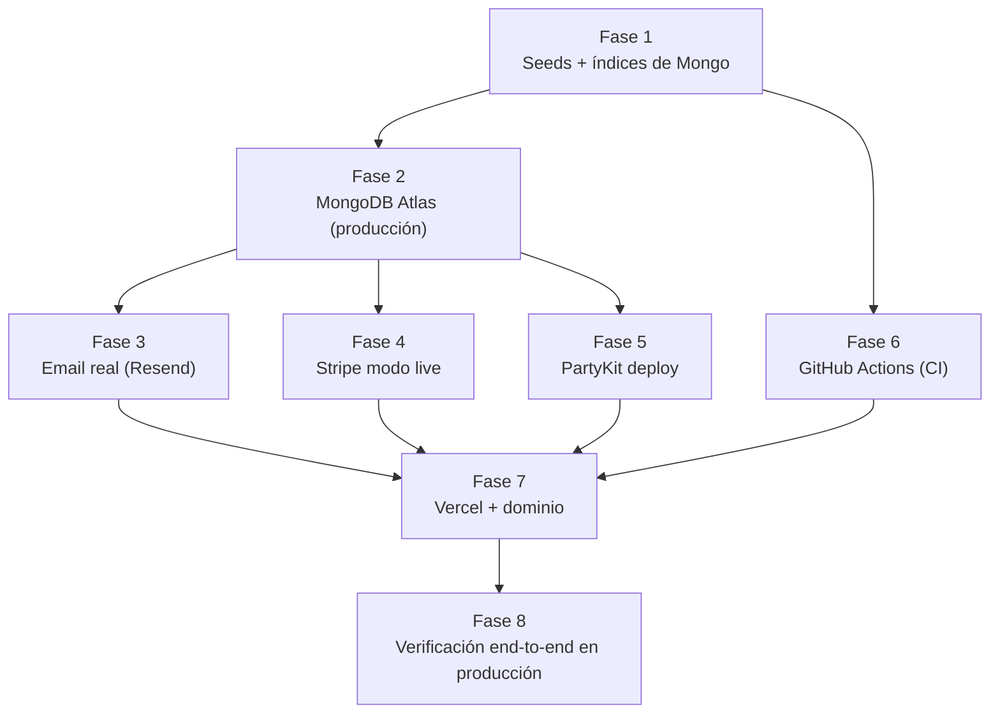
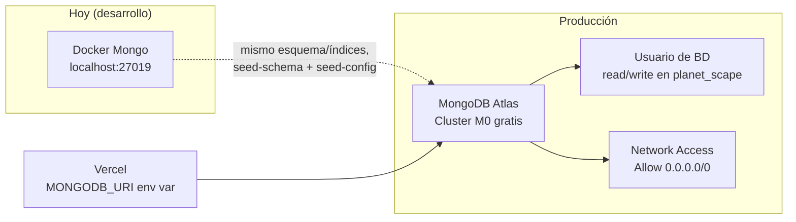
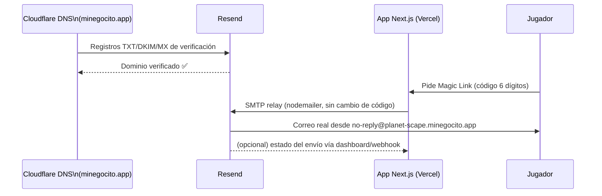
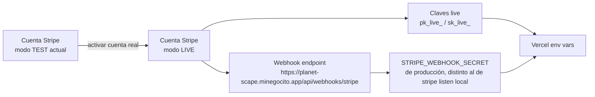
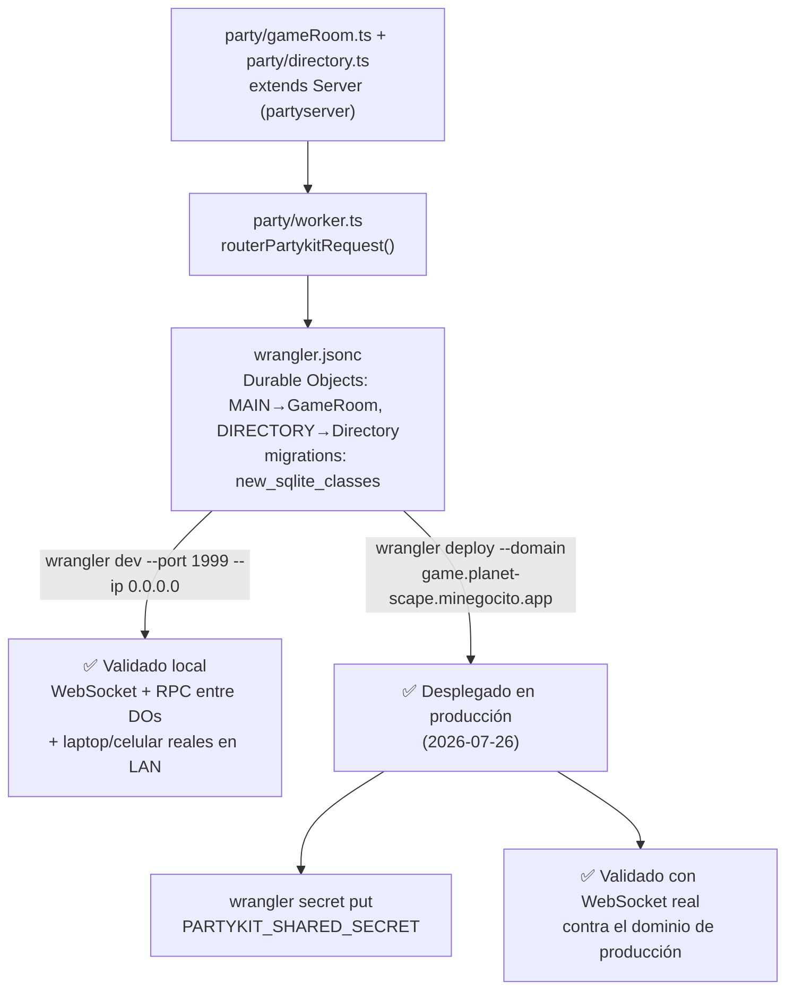
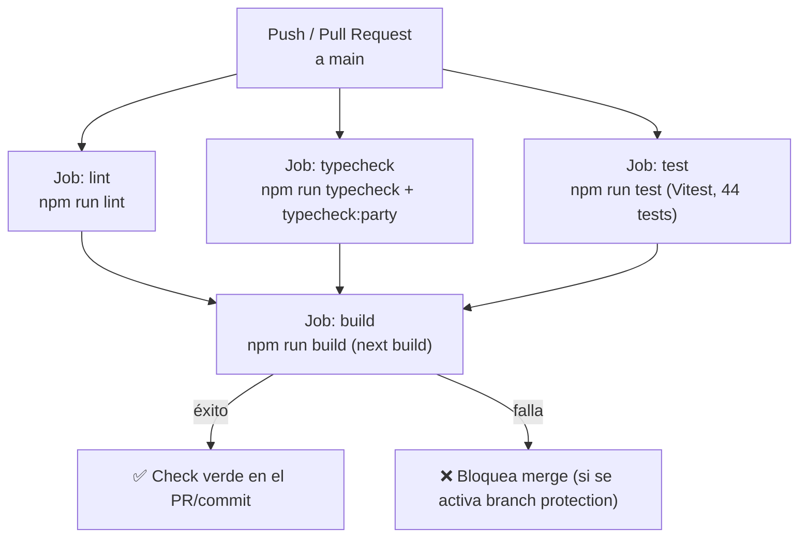
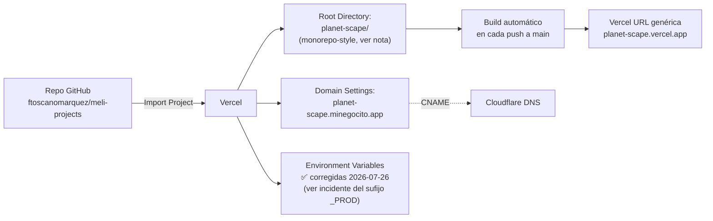

# PRE-PROD.md — Plan de puesta en producción

> Documento operativo de trabajo, complementario a [`DEPLOYMENT.md`](../DEPLOYMENT.md) (que define el checklist y los pasos de referencia) y a [`INFRA.md`](../INFRA.md) (variables de entorno completas). Este documento existe para **planificar, fechar y trazar** la ejecución real de la puesta en producción en fases, con diagramas de lo que se va a construir en cada una. Se actualiza a medida que avanzamos — cada fase se marca `⏳ pendiente` / `🔄 en curso` / `✅ hecho`, y cualquier decisión o desvío se anota inline con fecha.
>
> Aplica la misma regla de sincronización de [`AGENTS.md` §0.1](../AGENTS.md#01-regla-de-sincronizacion-de-documentacion): todo cambio real hecho durante la ejecución de este plan se refleja también en `DEPLOYMENT.md`/`INFRA.md`/`AGENTS.md` (changelog), no solo aquí.

**Creado**: 2026-07-25. **Última actualización**: 2026-07-26 (fin de sesión). **Estado general**: 🔄 en curso — Fases 1-6 completadas, Fase 7 (Vercel) desplegada y funcionando con el dominio propio, quedan pendientes puntuales antes de dar la Fase 7 por cerrada del todo. Ver "Punto de retomada" abajo.

**Contexto del objetivo** (para no perderlo de vista en ninguna fase): proyecto familiar/educativo, sin presupuesto, usando exclusivamente herramientas con tier gratuito. No se espera alto volumen de usuarios — las decisiones de esta guía priorizan simplicidad y costo cero sobre escalabilidad.

---

## 🔖 Punto de retomada (fin de sesión 2026-07-26)

**Resumen de lo que YA funciona en producción real** (`https://planet-scape.minegocito.app`):

- Landing pública, `/api/health` respondiendo con Mongo Atlas conectado.
- MongoDB Atlas, Resend (email), Stripe live (con webhook registrado), servidor multijugador (Cloudflare Worker) — todos desplegados y validados en algún punto de hoy.
- CI de GitHub Actions en verde.
- Login ahora es obligatorio para jugar cualquier planeta (incluidos los 4 gratis) — cambio de comportamiento pedido en vivo y ya desplegado.

**Lo último que se estaba resolviendo cuando se cortó la sesión** (2026-07-26, tarde-noche):

1. **Bug real encontrado y CORREGIDO**: 4 variables de entorno en Vercel (`AUTH_SECRET`, `NEXT_PUBLIC_PARTYKIT_HOST`, `APP_ORIGIN`, `PARTYKIT_SHARED_SECRET`) se habían guardado con el sufijo `_PROD` de más (arrastrado sin querer del archivo local `.env.atlas.local`, donde ese sufijo se usa a propósito para distinguirlas de los valores de desarrollo dentro del mismo archivo) — el código nunca las encontraba con ese nombre. Efecto real observado: el login por correo parecía funcionar (sin error en pantalla) pero el correo **nunca se intentaba enviar** (confirmado: no aparecía ni en los logs de Resend). Ya se corrigió: se borraron las 4 variables mal nombradas y se recrearon con el nombre correcto vía `vercel env add`, y se forzó un redeploy (`vercel redeploy <última URL de producción>`) para que las tomara.
2. **⏳ PENDIENTE DE CONFIRMAR mañana como primer paso**: el usuario iba a volver a intentar el login justo cuando se cortó la sesión — **hay que confirmar que el correo SÍ llega ahora** antes de dar este bug por cerrado del todo. Si sigue sin llegar, revisar de nuevo el dashboard de Resend (pestaña "Emails", no "Logs") para ver si esta vez sí aparece el intento.
3. **✅ Corregido, ya desplegado**: el texto de la pantalla de "ingresa el código" mencionaba literalmente "(o en Mailpit)" — texto de desarrollo que se había quedado hardcodeado y se veía en producción real. Ya corregido en `messages/es.json`/`en.json` (clave `codeStepHint`), commit y deploy pendientes de hacer (ver checklist abajo).
4. **⏳ PENDIENTE, pedido explícito del usuario, no implementado todavía**: subir el tiempo para poder ingresar el código de 6 dígitos (hoy son 10 minutos, `VERIFICATION_CODE_MAX_AGE_S` en `lib/auth.ts`) — el usuario lo pidió justo antes de que se detectara el bug de las variables de entorno, no se ha decidido a cuánto subirlo. **Definir el valor nuevo con el usuario antes de tocar código.**

**Checklist inmediato para la próxima sesión**:

- [ ] Confirmar con el usuario si el login/correo ya funciona en producción tras el fix de variables.
- [ ] Hacer commit + push del fix de `codeStepHint` (quitar mención a Mailpit) — está corregido en el working tree pero no subido a git todavía.
- [ ] Decidir y aplicar el nuevo tiempo de expiración del código de 6 dígitos.
- [ ] Retomar el plan original de Fase 7 (ver sección más abajo): confirmar variables completas, decidir si se elimina o se deja vivo el dominio `planet-scape.vercel.app` (el usuario preguntó al respecto — no hay razón técnica para eliminarlo, es decisión de preferencia).
- [ ] Fase 8 (verificación end-to-end) sigue sin arrancar formalmente.
- [ ] Pendiente ya acordado y pausado a propósito: implementar el resize reactivo completo del motor de juego (bug real de móvil/plegables al rotar/cambiar tamaño de viewport en plena partida) — el usuario confirmó que se haga DESPUÉS de cerrar Stripe/salas/producción. Diagnóstico completo ya hecho (ver sección "Bugs reales encontrados hoy" abajo) — falta solo implementar.

---

## Mapa de dependencias entre fases



Las Fases 2-5 pueden avanzar casi en paralelo (todas dependen de que Fase 1 esté cerrada, pero no dependen entre sí) — se documentan en orden secuencial solo para que la sesión de trabajo tenga un hilo claro, no porque una bloquee estrictamente a otra (excepto donde se indique).

---

## Fase 1 — Arreglar seeds rotos + auditar colecciones/índices ✅ hecho (2026-07-25)

### Qué se hizo (2026-07-25, sesión anterior)

Se auditó `package.json` y `scripts/seeds/`. Hallazgo confirmado:

- `npm run seed` (compuesto) llama a `seed:schema && seed:abilities && seed:planets && seed:config` — pero **`seed-abilities.ts` y `seed-planets.ts` no existen** en `scripts/seeds/` (nunca se implementaron — pertenecen al catálogo dinámico de planetas/habilidades, explícitamente pendiente de especificación futura, ver [`AGENTS.md` §15](../AGENTS.md#15-preguntas-abiertas--riesgos)).
- Los scripts que sí existen y sí son necesarios para producción: `seed-schema.ts` (índices), `seed-config.ts` (documento `game_config` + `space_facts`, con migración aditiva no destructiva), `promote-admin.ts` (promover una cuenta a admin por email).
- `seed:data` (→ `seed-data.ts`, jugadores/sesiones mock) tampoco existe — es solo para pruebas locales, **no debe correrse en producción** de todos modos.

### Qué se hizo (2026-07-25, ejecución real)

1. **`package.json` corregido**: `seed:abilities`/`seed:planets`/`seed:data` (referenciaban archivos inexistentes) fueron removidos. `npm run seed` ahora encadena `seed:schema && seed:config && seed:admins` — validado corriendo dos veces seguidas contra Mongo local (idempotente, sin duplicar ni romper nada).
2. **Nuevo script `seed-admins.ts`** — pedido explícito del usuario (2026-07-25): crea/asegura las 2 cuentas admin iniciales del proyecto, **sin depender de que la persona ya haya iniciado sesión** (a diferencia de `seed:admin`/`promote-admin.ts`, que sigue existiendo aparte para promover a cualquier otro jugador futuro):
   - `francisco.alberto.tm@gmail.com` → Francisco Toscano
   - `melissa.amaia.ta@gmail.com` → Melissa Toscano

   El documento se crea con la misma forma que espera el adapter de Auth.js (identificado por `email`), con `profileCompleted: true` para que nunca les salga el onboarding obligatorio, y `role: "admin"` desde el arranque.
3. **Trazabilidad de donantes y jugadores activos** (pregunta adicional del usuario durante esta fase, ver también §7 de `AGENTS.md`): la colección `donations` ya ligaba cada donación a `playerId`, pero no tenía índice propio ni un resumen agregado — se agregó:
   - Índice nuevo `donations.playerId + createdAt`.
   - Campos resumen en `players`: `totalDonatedCents`, `donationCount`, `lastDonationAt` (actualizados automáticamente desde `app/api/webhooks/stripe/route.ts` al completarse un pago), y `gamesPlayedCount`, `lastActiveAt` (actualizados desde `app/api/sessions/complete/route.ts` al terminar una partida).
   - Índices `players.totalDonatedCents` (desc) y `players.lastActiveAt` (desc) para poder ordenar/filtrar "top donantes" o "jugadores más activos" sin agregaciones pesadas — pensado para una campaña futura con beneficios a quien ya donó.
   - Backfill no destructivo en `seed-schema.ts` (`updateMany` solo sobre documentos sin el campo) para que jugadores ya existentes reciban estos campos en `0`/`null`, sin pisar nada.
4. **Confirmado el listado completo de colecciones e índices** contra `seed-schema.ts` (ya inventariado, actualizado con lo nuevo):

   | Colección | Índice(s) | Notas |
   |---|---|---|
   | `players` | `email` (único), `displayName` (único) | alias único para distinguir jugadores en multijugador |
   | `leaderboard` | `bestScore` desc, `playerId` (único) | |
   | `star_transactions` | `playerId` + `createdAt` desc | |
   | `game_sessions` | `playerId` + `endedAt` desc | |
   | `donations` | `stripeSessionId` (único) | idempotencia del webhook |
   | `planet_stats` | `planet` (único) | contador ❤️ |
   | `feedback` | `read` + `createdAt` desc | baja lógica |
   | `chat_messages` | `roomId` + `sentAt` desc; `flagged` + `sentAt` desc | histórico + moderación |
   | `reports` | `status` + `createdAt` desc | denuncias |
   | `notifications` | `playerId` + `createdAt` desc | |
   | `profile_change_requests` | `status` + `createdAt` desc | |
   | `room_leaderboard` | `roomId` (único), `level` desc | Top 5/10 de salas |
   | `game_config` | (documento único, sin índice — `seed-config.ts`) | |
   | `space_facts` | `key` (único, creado inline en `seed-config.ts`) | |

   Colecciones usadas en código pero **sin índice explícito todavía** (leídas siempre por `_id` o filtros ad-hoc): `sessions`/`verification_tokens` (Auth.js, gestionadas por `@auth/mongodb-adapter`, normalmente crean sus propios índices TTL automáticamente) — no requieren acción manual.
5. **Validado real**: `npm run seed` corrido dos veces seguidas contra Mongo local (idempotente) y una vez contra MongoDB Atlas real (ver Fase 2 — base nueva, resultado limpio: 14 colecciones, solo las 2 cuentas admin, `game_config` con 1 documento, `space_facts` con 100 documentos).

**Decisión tomada**: los 3 scripts faltantes (`seed-abilities`/`seed-planets`/`seed-data`) se **quitaron** del `package.json` en vez de crearse como stubs — pertenecen al catálogo dinámico de planetas/habilidades, explícitamente fuera de alcance (ver `AGENTS.md` §15). Se re-crearán cuando esa especificación futura exista.

---

## Fase 2 — MongoDB Atlas (base de datos de producción) ✅ hecho (2026-07-25)

### Qué vamos a construir



### Pasos ejecutados

1. ✅ Cuenta Atlas creada (login con Google).
2. ✅ Cluster **M0 gratis** creado, nombre `planet-scape`, provider AWS, región `us-east-1` (N. Virginia) — vía el flujo simplificado "Create a free starter database" (Atlas preselecciona M0/AWS por debajo, sin preguntar explícitamente).
3. ✅ Usuario de base de datos creado automáticamente por el flujo de Atlas (`franciscoalbertotm_db_user` + password autogenerado) — nota: quedó con rol **"Atlas Admin"** (más amplio que el `readWrite` acotado sobre `planet_scape` que se planeaba originalmente). Aceptable para el tamaño de este proyecto; **pendiente opcional** de acotar el rol desde Database Access si se quiere reducir superficie de permisos más adelante.
4. ✅ **Network Access**: `0.0.0.0/0` agregado como regla **permanente** (toggle de "temporary, delete in 6h" dejado apagado a propósito) — necesario porque Vercel usa IPs de salida dinámicas. Comentario dejado en Atlas: "Vercel serverless - IPs dinámicas". Convive con la IP local que Atlas agregó automáticamente durante el setup.
5. ✅ Connection string obtenido (Connect → Drivers → Node.js): `mongodb+srv://franciscoalbertotm_db_user:<password>@planet-scape.qtpaq4o.mongodb.net/?retryWrites=true&w=majority&appName=planet-scape`. Guardado en un archivo **separado** `.env.atlas.local` (nunca en `.env.local`, para no pisar la config de desarrollo local que sigue apuntando a Docker) — ya cubierto por `.gitignore` (regla `.env*`).
6. ✅ Corridos los 3 scripts reales (`seed-schema` → `seed-config` → `seed-admins`) con `npx tsx --env-file=.env.atlas.local scripts/seeds/<script>.ts`.
7. ✅ Verificado con una consulta directa (driver de Mongo) — resultado limpio confirmado:
   - **14 colecciones** creadas con sus índices.
   - `players`: **solo 2 documentos**, ambos `role: "admin"` (`francisco.alberto.tm@gmail.com`/`melissa.amaia.ta@gmail.com`) — sin ningún dato de las pruebas locales, confirmado explícitamente que esto era lo esperado (bases de datos completamente separadas, nunca se migran datos de prueba de local a Atlas).
   - `game_config`: 1 documento. `space_facts`: 100 documentos.

### Cómo ver los datos visualmente (para el usuario)

Dos formas, no excluyentes: **MongoDB Compass** (app de escritorio ya instalada — se conecta con el mismo connection string de Atlas, guardado como una conexión separada de la de Docker local) o **Atlas Data Explorer** (botón "Browse Collections" dentro del dashboard de Atlas, sin instalar nada).

### Nota de seguridad

El `MONGODB_URI` de producción es un secreto — para Vercel va **solo** en Project Settings → Environment Variables (nunca en un archivo versionado). El archivo local `.env.atlas.local` usado para correr los seeds tampoco se versiona (cubierto por `.gitignore`).

---

## Fase 3 — Email real de producción (Resend + dominio propio) ✅ hecho (2026-07-25)

> Decisión ya tomada con el usuario (2026-07-25): **Resend**, aprovechando el dominio propio `minegocito.app` (Cloudflare) que ya se planea usar para el subdominio del juego. Alternativa descartada: Gmail SMTP (más simple pero sin panel de entregabilidad ni remitente propio del dominio del proyecto).

### Qué vamos a construir



### Pasos ejecutados (email)

1. ✅ Cuenta gratuita creada en [resend.com](https://resend.com) (login con Google, 3,000 emails/mes gratis).
2. ✅ Dominio agregado: **`planet-scape.minegocito.app`** (mismo subdominio ya decidido para Vercel en Fase 7 — reutilizado también para email, en vez de un subdominio de correo aparte).
3. ✅ **"Auto configure"** usado (integración directa Resend↔Cloudflare vía OAuth, one-time authorization) — agregó automáticamente los 3 registros DNS sin copiar/pegar manual: `MX` (`send.planet-scape` → `feedback-smtp.us-east-1.amazonses.com`), `TXT` DKIM (`resend._domainkey.planet-scape`), `TXT` SPF (`send.planet-scape` → `v=spf1 include:amazonses.com ~all`). Los 3 con `Proxy status: DNS only` (correcto, no debe llevar el proxy naranja de Cloudflare).
4. ✅ Verificación completada en ~10 minutos (Domain added → DNS verified → Domain verified, los 3 registros en estado "Verified"). DMARC quedó como opcional, sin configurar por ahora (no bloqueante, se puede agregar después).
5. ✅ API Key generada (`planet-scape-smtp`, alcance "Sending access") — usada vía **SMTP genérico** (no el SDK de Resend) para no tocar código, ya que `lib/mail/sendMagicLinkEmail.ts` ya usa `nodemailer` con host/puerto/usuario/contraseña por variables de entorno (ver `AGENTS.md` §6.1). Credenciales SMTP de Resend: usuario siempre literal `resend`, contraseña = la API key.
6. ✅ Variables confirmadas y probadas:

   ```env
   EMAIL_SERVER_HOST=smtp.resend.com
   EMAIL_SERVER_PORT=465
   EMAIL_SERVER_USER=resend
   EMAIL_SERVER_PASSWORD=re_xxxxxxxx...   # secreto real, va solo en Vercel
   EMAIL_FROM=Planet Scape <no-reply@planet-scape.minegocito.app>
   ```

   Puerto **465** elegido a propósito (no 587): el código no pasa la opción `secure` a `nodemailer.createTransport()`, así que depende del default de la librería — `secure: true` automático solo cuando el puerto es exactamente `465`, que es justo lo que Resend espera ahí. Con 587 habría hecho falta tocar código para forzar STARTTLS.
7. ✅ **Prueba real de punta a punta**: envío directo por SMTP (simulando `sendMagicLinkEmail.ts`) a `francisco.alberto.tm@gmail.com` — `transport.verify()` OK, correo entregado en la **bandeja principal** (no spam) en segundos, `messageId` confirmando el dominio propio (`@planet-scape.minegocito.app`).
8. ⏳ Pendiente confirmar en Vercel al desplegar (Fase 7): `DEV_AUTO_LOGIN` ausente o `false` — ya bloqueado también por código vía `NODE_ENV !== "production"`, pero debe confirmarse en la config real de Vercel.

### Pendiente / no bloqueante

- DMARC (capa extra anti-spoofing, opcional en Resend) — se puede agregar después sin prisa.
- Cloudflare Email Routing (recepción de correo, ej. para soporte) — no se activó ("Enable Receiving" quedó apagado a propósito), no bloqueante, se puede activar cuando se necesite.

---

## Fase 4 — Stripe en modo live 🔄 en curso (2026-07-25) — claves listas, falta webhook (depende de Fase 7)

### Qué vamos a construir



### Pasos ejecutados (Stripe)

1. ✅ Cuenta Stripe real activada (2026-07-25) — flujo completo de onboarding en el dashboard: tipo de negocio (persona física, categoría "Software" con descripción explicando el proyecto y las donaciones voluntarias), datos personales/RFC, cuenta bancaria (CLABE) con transferencias **automáticas semanales**, descripción del cargo en el extracto bancario `PLANETSCAPE` (descripción abreviada opcional `DONACION`, dejada para reutilizar en proyectos futuros similares), Stripe Tax omitido (no aplica a donaciones voluntarias sin obligación fiscal de cobrar impuesto al donante).
2. ✅ Verificación de identidad (INE) subida — quedó "En revisión" por Stripe (mensaje de 1-2 días hábiles) con las **transferencias temporalmente suspendidas** por una tarea vencida: sin embargo, al verificar el estado real de la cuenta vía API (`stripe.accounts.retrieve()`), tanto `charges_enabled` como `payouts_enabled` ya estaban en `true` — la cuenta está operativa de verdad pese al aviso. Revisar de todos modos en los próximos días si Stripe envía alguna notificación adicional.
3. ✅ Claves **live** obtenidas y **validadas contra la API real** (mismo chequeo que se hizo en una sesión anterior del proyecto, cuando unas claves de test resultaron inválidas — ver `RETROSPECTIVA.md`): `stripe.accounts.retrieve()` confirmó `acct_1TqTXu1Mry48h7K7`, país `MX`, moneda `mxn`. Guardadas en `.env.atlas.local` (no versionado) — pendiente de copiar a Vercel en Fase 7.
4. ⏳ **Pendiente — depende de Fase 7**: registrar el webhook de producción en el dashboard de Stripe apuntando a `https://planet-scape.minegocito.app/api/webhooks/stripe` (evento `checkout.session.completed`), y copiar el `STRIPE_WEBHOOK_SECRET` resultante — Stripe requiere una URL pública real ya funcionando para generar este secreto, no se puede adelantar sin el dominio de Vercel activo.
5. ⏳ Pendiente: cargar las 3 variables de Stripe en Vercel (Fase 7) y hacer una prueba real con una donación de monto mínimo, confirmando que las 200 estrellas se acreditan y el webhook responde 200.

### Nota

Igual que en Fase 2, la migración de claves de test a live **no requiere cambios de código** — todo vía variables de entorno (`lib/stripe.ts` ya las lee de `process.env`).

---

## Fase 5 — PartyKit deploy a producción ✅ hecho (2026-07-26) — migrado a `partyserver`/Wrangler, desplegado y validado en producción real

> **La plataforma gestionada de PartyKit quedó bloqueada** — ver el incidente completo en `RETROSPECTIVA.md`. Resumen: `npx partykit deploy` (sin dominio propio) falló por saturación de la zona compartida `partykit.dev` (límite de 10,000 dominios); con `--domain` + credenciales de Cloudflare propias, falló porque el CLI `partykit` (v0.0.115, sin actualizar desde antes de que Cloudflare comprara PartyKit en 2024) no genera la migración `new_sqlite_classes` que Cloudflare ahora exige para Durable Objects en el plan gratuito. Se investigó con un agente y se confirmó que **`partyserver`** (mismo equipo de Cloudflare, activamente mantenido) es el reemplazo directo — misma forma de API, corre sobre Wrangler nativo.

### Qué se construyó



### Pasos ejecutados (PartyKit → Wrangler, desarrollo)

1. ✅ Instalado `partyserver` + `wrangler@4.114.0` (con `@cloudflare/workers-types` como devDependency explícita) — desinstalado el paquete legado `partykit`.
2. ✅ `wrangler.jsonc` creado (reemplaza `partykit.json`): bindings `MAIN`→`GameRoom`, `DIRECTORY`→`Directory` (el binding se llama `MAIN`, no `GAME_ROOM`, a propósito — `routePartykitRequest` deriva la ruta URL del nombre del binding en kebab-case, y el cliente ya se conecta a `/parties/main/{roomId}` por defecto sin tocarlo), bloque `migrations` con `new_sqlite_classes: ["GameRoom", "Directory"]`.
3. ✅ `party/gameRoom.ts`/`party/directory.ts` migrados a `extends Server<Env>` (antes `implements Party.Server`) — cambios mecánicos, misma lógica de negocio intacta. `party/worker.ts` nuevo como punto de entrada.
4. ✅ `party/tsconfig.json` aislado creado — necesario porque `@cloudflare/workers-types` en el `tsconfig.json` raíz rompía el tipado de `Response.json()` en toda la app Next.js (ver `RETROSPECTIVA.md`). Nuevo script `npm run typecheck:party`.
5. ✅ **Validado localmente de punta a punta** con `npx wrangler dev --port 1999`: conexión WebSocket real a `GameRoom` (roster correcto, `leaderPlayerId` asignado), y RPC directo `GameRoom`→`Directory` confirmado (crear una sala nueva actualiza la lista del directorio en tiempo real, sin polling) — mismo comportamiento que la arquitectura original con PartyKit.
6. ✅ **Validado con dispositivos reales en LAN** (laptop + celular): `wrangler dev` por defecto solo escucha en `127.0.0.1` (a diferencia de `next dev`, que escucha en todas las interfaces) — el celular veía "sin salas" pese a que la laptop ya había creado una. Corregido con `--ip 0.0.0.0`; ya incluido por defecto en `npm run party:dev` (ver `package.json`). Nota aparte: tras reiniciar el servidor, cualquier dispositivo con una conexión WebSocket vieja abierta necesita recargar la página — no se reconecta solo.

### Pasos ejecutados (deploy real a producción, 2026-07-26)

1. ✅ **Verificación de credenciales de Cloudflare antes de reintentar**: se confirmó vía la API de Cloudflare (`GET /accounts/{id}/workers/scripts` y `GET /zones/{id}/dns_records`) que los intentos fallidos anteriores (ver Fase 5 en `RETROSPECTIVA.md`) **no habían dejado ningún residuo** — ni Workers ni registros DNS huérfanos — antes de proceder con el deploy real, para partir de una cuenta limpia. El primer token de Cloudflare (plantilla "Edit zone DNS", insuficiente) fue revocado por el usuario directamente en el dashboard; el segundo (Custom Token con los 4 permisos correctos, ver `DEPLOYMENT.md` §3.2) es el que se conservó y usó.
2. ⚠️ **Primer intento de `wrangler deploy --domain game.planet-scape.minegocito.app` falló** con un error nuevo, distinto a los anteriores: `Error 10063 — You need a workers.dev subdomain in order to proceed`. Causa: es la **primera vez que esta cuenta de Cloudflare despliega cualquier Worker** — Cloudflare exige que la cuenta tenga un subdominio `*.workers.dev` asignado antes de poder desplegar, sin importar si se va a usar un dominio propio o no (el subdominio `workers.dev` es un identificador de nivel de CUENTA, no de este proyecto en particular). Se resolvió entrando una sola vez al dashboard de Cloudflare → "Workers & Pages" — Cloudflare asignó automáticamente `francisco-alberto-tm.workers.dev` sin pedir que se eligiera un nombre. Este paso es **único por cuenta**, no se repite en futuros deploys ni de este proyecto ni de otros.
3. ✅ **Reintento exitoso**: `npx wrangler deploy --domain game.planet-scape.minegocito.app` — subió el código (`Total Upload: 41.87 KiB / gzip: 11.77 KiB`), resolvió los bindings (`MAIN`→`GameRoom`, `DIRECTORY`→`Directory`), creó automáticamente el registro DNS para `game.planet-scape.minegocito.app` en la zona de Cloudflare (sin edición manual del panel de DNS) y activó TLS. `Current Version ID` confirmado en la salida del comando.
4. ✅ **`PARTYKIT_SHARED_SECRET` configurado en el Worker de producción** — generado nuevo y distinto al de desarrollo (`node -e "console.log(require('crypto').randomBytes(32).toString('hex'))"`, nunca reutilizar secretos de dev en prod), subido con:

   ```bash
   npx wrangler secret put PARTYKIT_SHARED_SECRET
   ```

   Guardado también en `.env.atlas.local` (como `PARTYKIT_SHARED_SECRET_PROD`, para no confundirlo con el de desarrollo) — pendiente de copiarlo tal cual a Vercel en la Fase 7, para que ambos lados (Worker y app Next.js) validen `/api/chat/log` con el mismo valor.
5. ⏳ **`APP_ORIGIN` queda en su valor de desarrollo** (`http://localhost:3000`) por decisión explícita — no existe todavía una URL real de la app Next.js en producción (eso es la Fase 7). Sin efecto práctico mientras no haya jugadores reales usando el chat en producción; se corrige en la Fase 7 en cuanto exista el dominio real de Vercel. No bloquea el resto del servidor multijugador (salas, roster, posiciones, directorio — todo eso no depende de `APP_ORIGIN`).
6. ✅ **Validado cómo se confirmó que el deploy real quedó arriba**: tres verificaciones independientes contra el dominio de producción real (no local):
   - `curl -s -o /dev/null -w "%{http_code}" https://game.planet-scape.minegocito.app/` → `404` (correcto, es la ruta raíz sin manejar — mismo comportamiento que en local).
   - `nslookup game.planet-scape.minegocito.app` → resuelve a IPs de Cloudflare reales (confirma el DNS creado automáticamente por Wrangler).
   - **Conexión WebSocket real** con el `WebSocket` nativo de Node contra `wss://game.planet-scape.minegocito.app/parties/main/{roomId}` — abrió correctamente y `GameRoom` respondió el mensaje `roster` esperado (jugador registrado, `leaderPlayerId` asignado), igual que en local pero contra la infraestructura real de Cloudflare.

---

## Fase 6 — GitHub Actions (CI) ✅ hecho (2026-07-26)

### Qué se construyó (CI)



### Alcance del workflow

- **No incluye** despliegue automático a Vercel/Cloudflare — Vercel ya hace su propio build+deploy automático al conectar el repo (Fase 7); el servidor multijugador se despliega aparte con `wrangler deploy` (Fase 5, ya hecho manualmente). Este workflow es de **validación** (CI puro), no de CD.
- Jobs: `lint`, `typecheck` (app + `typecheck:party` por separado, ver Fase 5), `test` (Vitest), `build` (`next build`) — este último depende de que los 3 anteriores pasen primero (`needs: [lint, typecheck, test]`).
- Los tests E2E (Playwright) y de carga (k6) **no** corren en cada push — quedan fuera de este primer workflow, se pueden agregar después como job manual (`workflow_dispatch`) si hace falta; requieren Mongo/el servidor multijugador levantados, más complejo de simular en el runner de GitHub.
- Node 22 (LTS, coincide con lo que usa Vercel para proyectos Next.js — no había `.nvmrc`/`engines` declarado en el proyecto, se fijó explícitamente en el workflow).
- Cache de `~/.npm` vía `actions/setup-node@v5` con `cache: npm`.

### Hallazgos reales encontrados ANTES de escribir el workflow (validado todo localmente primero)

1. **4 de 44 tests unitarios ya estaban fallando** (`npm run test` corrido como chequeo previo, nunca antes ejecutado en CI) — desactualizados respecto a cambios reales de comportamiento hechos en sesiones anteriores sin que nadie los actualizara: la secuencia de muerte (`gameStatus: "dying"` antes de `"gameover"`, ver AGENTS.md §5.3) y los planetas premium (Júpiter ya es un valor válido del schema, no solo los 4 iniciales, ver AGENTS.md §5.2). Corregidos para reflejar el comportamiento REAL vigente (nunca se tocó el código de producción) — detalle completo en `RETROSPECTIVA.md`.
2. **`next build` falla sin `MONGODB_URI`/`STRIPE_SECRET_KEY` definidas**, aunque no haga ninguna conexión real en build-time — confirmado probando el build con `.env.local` renombrado temporalmente (simulando el entorno limpio de un runner de GitHub Actions, que no tiene ningún `.env`). Causa: `lib/db.ts`/`lib/stripe.ts` lanzan un `throw` inmediato al importarse si la variable no existe, y Next.js evalúa esos módulos al "recolectar datos de página" de las rutas API en build-time — pero nunca las usa de verdad ahí (`getDb()`/las llamadas a la API de Stripe solo corren en runtime de una request real). Solución: variables **dummy** (no conexiones reales) en el workflow, suficientes para que el `throw` nunca dispare.
3. **`npm ci` fallaba con `ERESOLVE`** — mismo conflicto de peer dependencies entre `partyserver` (quiere `@cloudflare/workers-types@^4`) y `wrangler` (quiere `^5`) que ya se había resuelto localmente con `--legacy-peer-deps` durante la migración de la Fase 5, pero eso no queda reflejado en el `package-lock.json` de forma reproducible — `npm ci` (usado en CI, más estricto que `npm install`) volvía a fallar. Solución permanente: bloque `overrides` agregado a `package.json` (fuerza `@cloudflare/workers-types@^5` también como resolución del peer de `partyserver`), y `package-lock.json` regenerado — ya no depende de recordar pasar un flag especial.

### Archivo creado

`.github/workflows/ci.yml` — 4 jobs (`lint`, `typecheck`, `test`, `build`), validado corriendo cada paso localmente en el mismo orden y con las mismas variables dummy antes de subirlo, para no descubrir fallas solo hasta que corriera en GitHub.

### Hallazgos reales encontrados DESPUÉS de subirlo (validando el workflow de verdad, corriendo en GitHub)

Validar localmente los comandos no fue suficiente para garantizar que el workflow real funcionara — aparecieron 2 problemas más, específicos de correr dentro de GitHub Actions, que no se podían ver simulando comandos sueltos en la máquina local:

1. **El workflow nunca se disparó en el primer push** — `git push` se completó sin error, pero `gh run list` no mostraba ningún run. Causa real: el archivo se había creado en `planet-scape/.github/workflows/ci.yml`, pero GitHub Actions **solo descubre workflows en `.github/workflows/` exactamente en la raíz del repositorio** — y la raíz git real de este repo es `D:/meli-projects` (un nivel arriba de `planet-scape/`, donde vive el código). Se movió el archivo a `.github/workflows/ci.yml` (raíz real) y se le agregó `defaults.run.working-directory: planet-scape` + un filtro `paths: ["planet-scape/**", ".github/workflows/ci.yml"]` para que siga aplicando solo a este proyecto.
2. **Con el workflow ya disparándose, los 4 jobs fallaron en el paso `npm ci`** con `npm error code EUSAGE — package.json and package-lock.json ... are in sync` (`Missing: @swc/helpers@0.5.23 from lock file`). El lockfile tenía una inconsistencia menor (probablemente arrastrada de las varias instalaciones con `--legacy-peer-deps` de la Fase 5) que `npm install` en Windows toleraba en silencio, pero que `npm ci` en el runner Linux de GitHub rechaza de forma estricta por diseño (es justamente su propósito: instalar EXACTAMENTE lo que dice el lockfile, sin resolver nada). Solución: `rm -rf node_modules package-lock.json && npm install` completo desde cero, regenerando un lockfile consistente, validado de nuevo con `npm ci --dry-run` antes de subirlo.

**Resultado final**: segundo push con el lockfile regenerado — los 4 jobs (`typecheck`, `test`, `lint`, `build`) pasaron en verde, confirmado en `https://github.com/ftoscanomarquez/meli-projects/actions`. **Lección general**: para herramientas de CI/CD, "funciona en mi máquina" (o incluso "funciona simulando los comandos localmente") no es prueba suficiente — hay que ver el run real completarse en la plataforma de destino al menos una vez antes de dar la fase por cerrada, porque hay diferencias de entorno (ubicación del workflow, SO del runner, estrictez de `npm ci` vs `npm install`) que solo se manifiestan ahí.

---

## Fase 7 — Conectar Vercel + dominio propio 🔄 en curso (2026-07-26) — desplegado y funcionando, quedan pendientes puntuales

### Qué se construyó (Vercel)



### Nota importante — estructura de repo

El repo real en GitHub (`meli-projects`) tiene la raíz git en `D:/meli-projects`, con el proyecto viviendo en la subcarpeta `planet-scape/` (confirmado en la sesión anterior — ver el commit inicial, todas las rutas llevan el prefijo `planet-scape/`). **Vercel necesita configurarse con "Root Directory" = `planet-scape`** al importar el proyecto, para que encuentre `package.json`/`next.config.ts` correctamente.

### Pasos ejecutados (Vercel)

1. ✅ Vercel conectado a GitHub (cuenta previamente ligada a Gmail/GitLab — se agregó la conexión de GitHub aparte, sin romper la de GitLab que se usa para otro tipo de proyectos del usuario). Import con "Only select repositories" → solo `meli-projects`, no toda la cuenta.
2. ✅ **Root Directory = `planet-scape`** — detectado automáticamente por Vercel al importar (no hizo falta editarlo a mano).
3. ✅ **Project Name cambiado** de `meli-projects` (default, heredado del nombre del repo) a `planet-scape` — más claro, y deja espacio para que futuros proyectos en el mismo repo tengan su propio nombre en Vercel.
4. ✅ Primer deploy exitoso — dominio gratis `planet-scape.vercel.app` funcionando desde el primer intento (landing real visible, con el dato curioso/carrusel de planetas).
5. ✅ **Dominio propio agregado**: `planet-scape.minegocito.app` vía "Add Existing" en Vercel → Domains, registro `CNAME` (`planet-scape` → `5054d10b09779880.vercel-dns-017.com`, Proxy: Disabled/DNS only) agregado en Cloudflare — validado y con TLS automático emitido ("Valid Configuration" en Vercel).
6. ✅ Variables de entorno cargadas en bloque (formato `.env` pegado directo en el formulario de Vercel, Environments: Production + Preview) — `MONGODB_URI`, `MONGODB_DB`, `AUTH_SECRET`, `EMAIL_SERVER_*`, `EMAIL_FROM`, claves de Stripe live, `NEXT_PUBLIC_PARTYKIT_HOST`, `PARTYKIT_SHARED_SECRET`, `APP_ORIGIN`, `NEXT_PUBLIC_WHATSAPP_LINK`, `NEXT_PUBLIC_DEFAULT_LOCALE`, `NEXT_PUBLIC_LOCALES`, `PINO_LOG_LEVEL`. `STRIPE_WEBHOOK_SECRET` se dejó fuera del primer bloque a propósito (dependencia circular: Stripe necesita la URL real ya funcionando para generarlo) y se agregó después (paso 9).

### ⚠️ Incidente real encontrado y corregido: variables con sufijo `_PROD` de más

Al copiar los valores desde `.env.atlas.local` (donde `AUTH_SECRET_PROD`/`NEXT_PUBLIC_PARTYKIT_HOST_PROD`/`APP_ORIGIN_PROD`/`PARTYKIT_SHARED_SECRET_PROD` usan ese sufijo a propósito, para distinguirlos de los valores de desarrollo que conviven en el mismo archivo), el sufijo se copió por error también como **nombre de la variable en Vercel** — el código nunca busca `AUTH_SECRET_PROD`, busca `AUTH_SECRET` a secas. Efecto real: Auth.js/el resto del código nunca encontraban estas 4 variables (equivalente a que no existieran), pero sin lanzar ningún error visible en pantalla para el usuario — el síntoma fue que el login por correo parecía completarse (pasaba a la pantalla de "ingresa el código") pero **el correo real nunca se enviaba** (confirmado: no aparecía ni en el dashboard de Resend). Diagnóstico: se probó primero el envío directo con las mismas credenciales de Resend (sí funcionó, descartando problema de Resend/entregabilidad), luego se revisaron las variables reales configuradas en Vercel vía `npx vercel env ls production` — ahí se vieron los 4 nombres con `_PROD` de sobra. Corrección: `npx vercel env rm <nombre>_PROD` + `npx vercel env add <nombre>` (production y preview por separado, el CLI no acepta ambos entornos en una sola invocación) para las 4 variables, seguido de un redeploy forzado (`npx vercel redeploy <última URL de producción>`) para que el nuevo build las tomara. **Pendiente confirmar en la próxima sesión** que el correo ya llega — el fix se aplicó justo al cierre de la sesión, sin haber podido validar el resultado final con un login real todavía.

### Pasos que faltan

1. ⏳ Confirmar que el login/correo funciona tras el fix de variables (primer paso de la próxima sesión).
2. ⏳ Decidir si se elimina o se deja vivo `planet-scape.vercel.app` — no hay razón técnica para eliminarlo (sirve la misma app, el webhook de Stripe funciona igual sin importar por cuál dominio entre el usuario, ya que es una URL fija registrada aparte en Stripe) — es una decisión de preferencia/orden del usuario, quedó sin decidir.
3. ✅ Webhook de Stripe registrado en el dashboard (modo live) apuntando a `https://planet-scape.minegocito.app/api/webhooks/stripe`, evento `checkout.session.completed` — `STRIPE_WEBHOOK_SECRET` agregado a Vercel tras esto. **Falta la prueba real de una donación de punta a punta** (se iba a hacer, pero se priorizó primero diagnosticar/arreglar el bug del login).
4. ⏳ `APP_ORIGIN`/`NEXT_PUBLIC_PARTYKIT_HOST` del Worker de Cloudflare ya estaban correctos desde la Fase 5 (se corrigieron ahí, no en esta fase) — confirmado que las salas multijugador siguen respondiendo bien tras los redeploys de hoy (`wss://game.planet-scape.minegocito.app` probado con WebSocket real, roster correcto).

---

## Fase 8 — Verificación end-to-end en producción ⏳ pendiente

Checklist final (subconjunto operativo de `DEPLOYMENT.md` §3.4, ejecutado de verdad):

1. `GET /api/health` responde `{status:"ok", checks:{mongo:true}}` en el dominio de producción.
2. Flujo de Magic Link completo con un correo real (no Mailpit) — confirmar en Resend dashboard que se marcó `Delivered`.
3. Registro obligatorio de perfil (alias/nombre/fecha nacimiento/T&C) de punta a punta.
4. Partida en solitario completa, guardado de sesión (`game_sessions`/`star_transactions`/`leaderboard`) verificado en Atlas.
5. Partida multijugador con 2 dispositivos reales distintos (confirma PartyKit de producción + sincronización determinista).
6. Donación real de monto mínimo vía Stripe live, confirmar 200 estrellas acreditadas y evento de webhook en 200.
7. Panel de admin accesible solo para la cuenta promovida (`seed:admin` corrido contra Atlas).
8. Revisar `npm audit` una vez más antes de anunciar el lanzamiento (ver pendiente ya anotado en `DEPLOYMENT.md` §2).

---

## Preguntas abiertas para la próxima sesión

- ¿Los 3 seeds faltantes (`seed-abilities`/`seed-planets`/`seed-data`) se crean como stubs vacíos o se quitan del `package.json`? (Fase 1)
- Nombre final del remitente de correo (Fase 3).
- ¿Activar Cloudflare Email Routing para recepción de correo del dominio? (Fase 3, no bloqueante)
- ¿Stripe live se valida con una donación real o se deja en modo test hasta el lanzamiento público? (Fase 4)
- Alcance exacto del primer `ci.yml`: ¿incluir Playwright/k6 como job manual (`workflow_dispatch`) desde el día uno, o agregarlo después? (Fase 6)
- Confirmar si `game.minegocito.app` (PartyKit) y `planet-scape.minegocito.app` (Vercel) son los subdominios finales, o el usuario prefiere otros nombres.
